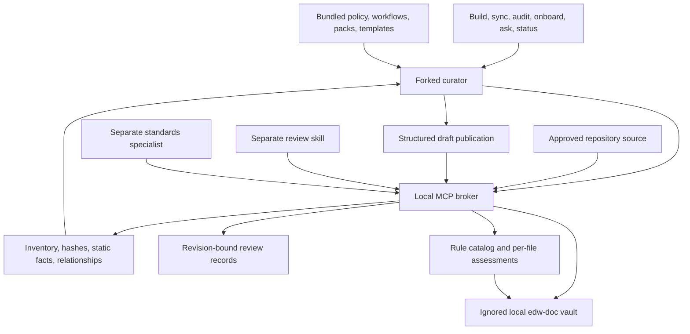

# Architecture

EDW Doc separates local source mechanics from model reasoning. The runtime builds a bounded, inspectable baseline; the host agent explains supported behavior; a separate reviewer can examine those explanations.

## Responsibilities

**Broker/runtime:** determine the approved root, filter and inventory sources, read bounded content, calculate hashes, extract supported static structure, derive note paths, validate publication evidence, write managed files, track change impact, and check references. It never executes repository code or directly invokes a model.

**Curator:** infer repository purpose from evidence, choose component lenses, inspect important relationships, explain behavior, publish structured drafts, and report uncertainty. It is the sole free-form note publisher at the agent layer. It runs sequentially so ordinary skill execution does not depend on nested subagents.

**Worker:** optionally inspect a bounded source set and return evidence without changing files. A host may dispatch workers when supported; they are not a prerequisite for the main flow.

**Reviewer:** inspect a published note and original sources in a separate context, then record a qualified verdict against the exact note hash. It cannot rewrite notes or approve on behalf of a human.

**Standards specialist:** discover cited repository requirements and observed conventions, inspect bundled advisory guidance, and record per-file results against exact source and rule revisions. It uses only read tools plus `vault_rule` and `vault_assess`, with no scan, general publication, execution, or web capability. The runtime creates rule descriptions, category navigation, file tables, reverse links, and coverage. The curator can read these results but cannot submit them.

**Local installer:** a separate explicit CLI manages only owned instructions, configuration, references, and ignore additions within the selected Git root. It preserves tracked or unignored instructions, AGENTS-only setups, settings, and user changes. Ownership records support idempotent updates and selective uninstall. It never creates `CLAUDE.local.md`. This setup capability is not exposed to analysis agents.

**Maintenance controller:** packaged host hooks use installed configuration to reconcile an existing vault and track a bounded AI-sync opportunity. They do not execute source or invoke a model themselves. CLI and MCP entry points follow the installed vault name unless explicitly configured otherwise; a conflicting host environment name is rejected.

## Source, note, and relationship identity

Source records include a repository-relative path, stable managed ID, content fingerprint where available, classification, inclusion status, and coverage reason. Existing paths retain identity. An unambiguous exact-content rename can retain identity; edited or ambiguous renames may appear as deletion and addition.

Notes use managed paths and source references. Agents obtain valid note targets from broker inventory and note reads instead of inventing filenames. This keeps vault-local wiki links independent of workstation absolute paths. Source evidence includes its own hash and location; a commit identifier alone would not describe uncommitted changes.

Static import and literal-reference relationships provide navigation and invalidation candidates. They are not a complete call graph or full runtime lineage. Model-derived flow edges must cite the sources establishing their conditions and uncertainty.

## Instruction hierarchy

Policy defines authority and output limits. Skill entry points select workflows. Workflows select relevant domain packs and templates. Evidence packets constrain each analysis unit. Templates organize supported content; they cannot manufacture missing facts.

The normal flow loads references through `vault_context`, avoiding native file-read tools. Source files with instruction-like text remain evidence data. Organizational requirements can be cited as standards only when actually supplied in the approved sources.

The file-analysis workflow requires concrete execution steps, branches, helpers, inputs/outputs, failure paths, and exact test assertions where applicable. Detail follows complexity. File notes explain implementation, component notes explain cooperation between files, and flow notes trace a process across components. Onboarding links those layers into a reading path. None of these templates permits inventing missing facts.

The shared [documentation style](../policies/documentation-style.md) uses plain language, numbered steps and reading paths where order matters, and small evidence-backed diagrams when useful. Ordinary verified wiki links supply graph navigation; Mermaid edges alone do not populate the Obsidian graph. Presentation guidance cannot establish missing source behavior or runtime state.

Local setup routes a single eligible, locally ignored Claude instruction file through an owned import. Tracked, unignored, AGENTS-only, or ambiguous instruction structures use an ignored rule adapter that asks the host to read an exact instructions file. With no detected entry point, setup creates an ignored root `CLAUDE.md`. It does not infer that host loading succeeded: status reports activation as unverified. See [installation](installation.md) for the decision table and preservation behavior.

## Maintenance

Refresh compares source state to the last indexed state, accounts for additions, edits, deletions, and unambiguous renames, and invalidates affected generated content. File explanations track cited sources, linked source notes, transitive discovered dependencies, and changes to neighboring relationships. Aggregate explanations are conservatively invalidated after any inventory change. Reviewer evidence is checked separately. A current static inventory and a current model explanation are separate states; incomplete relationship coverage still requires conservative reinspection.

An analysis index links every current agent explanation and exposes its coverage and review state. It updates alongside publication, review, and refresh. Multi-file publication uses a recovery journal and atomic replacement of individual files; it is recoverable, not an atomic swap of the entire vault. A viewer may briefly see a mix of versions during an update.

Standards records are a separate data layer. Rules carry authority, scope, provenance, and a content hash. Assessments carry the inspected source hash, rule hash, reason, and evidence; changed file or rule evidence makes results stale. Initial candidates remain not assessed. Source-level verdicts, semantic explanation freshness, mechanical lint, and independent evidence review are distinct signals. The maintained advisory catalog is shipped offline with the plugin and does not imply automatic repository adoption.

The optional local watcher performs static maintenance while its process runs. It does not contact a model. Without installed local setup, the plugin `SessionStart` hook supplies only a read-only freshness notice.

With setup-enabled maintenance, `SessionStart`, `UserPromptSubmit`, `PostToolUse`, and `Stop` can reconcile an existing owned vault. Plan-mode and subagent events are skipped. `PostToolUse` skips EDW Doc broker calls and applies a two-second throttle; prompt and stop checkpoints reconcile without that throttle. A maintenance lock prevents concurrent controllers, while the engine retains its own writer checks. A receipt inside the vault records the inspected snapshot and whether its reminder has been shown.

Pending work includes invalidated explanations and included files without model enrichment. `Stop` records and emits one nonblocking reminder per pending snapshot. It never forces a continuation or launches a sweep. Later events inspect actual coverage; failures or incomplete work remain visible for manual action. Standards assessment and independent review remain separate workflows.

External edits, new directories, pulls, and branch changes are discovered at the next supported event or explicit static watcher scan. No background daemon, source Git hook, or host settings modification is installed. Session hooks do not run while the host is closed and never initialize a vault. Actual host loading and reminder behavior still require a smoke test; see [known limits](limitations.md).

## Boundaries

The default vault is `edw-doc/`, deliberately local and ignored. Build/sync ensures its ignore rule and `/.claude/` while preserving existing ignore content. A previous `doc-vault/` vault needs explicit migration or a configured custom vault name. The vault is not synchronized through normal source pushes. This version does not aggregate other repositories, crawl remote references, query cloud resources, execute tests, or apply source-code findings. Those would require distinct capabilities and permissions. The [business overview](business-overview.md) summarizes scope and preservation rules for readers who do not need implementation details.
