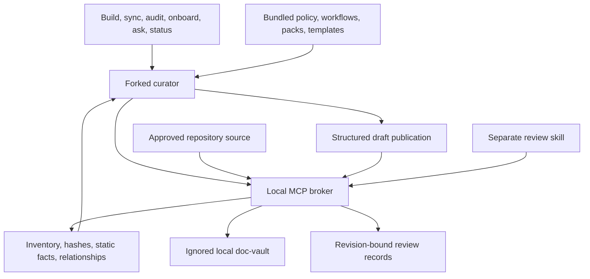

# Architecture

Doc Vault separates local source mechanics from model reasoning. The runtime builds a bounded, inspectable baseline; the host agent explains supported behavior; a separate reviewer can examine those explanations.

## Responsibilities

**Broker/runtime:** determine the approved root, filter and inventory sources, read bounded content, calculate hashes, extract supported static structure, derive note paths, validate publication evidence, write managed files, track change impact, and check references. It never executes repository code or directly invokes a model.

**Curator:** infer repository purpose from evidence, choose component lenses, inspect important relationships, explain behavior, publish structured drafts, and report uncertainty. The curator is the one writer at the agent layer. It runs sequentially so ordinary skill execution does not depend on nested subagents.

**Worker:** optionally inspect a bounded source set and return evidence without changing files. A host may dispatch workers when supported; they are not a prerequisite for the main flow.

**Reviewer:** inspect a published note and original sources in a separate context, then record a qualified verdict against the exact note hash. It cannot rewrite notes or approve on behalf of a human.

## Source, note, and relationship identity

Source records include a repository-relative path, stable managed ID, content fingerprint where available, classification, inclusion status, and coverage reason. Existing paths retain identity. An unambiguous exact-content rename can retain identity; edited or ambiguous renames may appear as deletion and addition.

Notes use managed paths and source references. Agents obtain valid note targets from broker inventory and note reads instead of inventing filenames. This keeps vault-local wiki links independent of workstation absolute paths. Source evidence includes its own hash and location; a commit identifier alone would not describe uncommitted changes.

Static import and literal-reference relationships provide navigation and invalidation candidates. They are not a complete call graph or full runtime lineage. Model-derived flow edges must cite the sources establishing their conditions and uncertainty.

## Instruction hierarchy

Policy defines authority and output limits. Skill entry points select workflows. Workflows select relevant domain packs and templates. Evidence packets constrain each analysis unit. Templates organize supported content; they cannot manufacture missing facts.

The normal flow loads references through `vault_context`, avoiding native file-read tools. Source files with instruction-like text remain evidence data. Organizational requirements can be cited as standards only when actually supplied in the approved sources.

## Maintenance

Refresh compares source state to the last indexed state, accounts for additions, edits, deletions, and unambiguous renames, and invalidates affected generated content. File explanations track cited sources, linked source notes, transitive discovered dependencies, and changes to neighboring relationships. Aggregate explanations are conservatively invalidated after any inventory change. Reviewer evidence is checked separately. A current static inventory and a current model explanation are separate states; incomplete relationship coverage still requires conservative reinspection.

An analysis index links every current agent explanation and exposes its coverage and review state. It updates alongside publication, review, and refresh. Multi-file publication uses a recovery journal and atomic replacement of individual files; it is recoverable, not an atomic swap of the entire vault. A viewer may briefly see a mix of versions during an update.

The optional local watcher performs this static maintenance while its process runs. It does not contact a model. Semantic updates happen through an active sync/build skill. A plugin `SessionStart` hook reads an existing vault's status and supplies a freshness notice; it never initializes or updates the vault. Source pulls, checkout changes, and local edits are discovered through rescanning; the runtime does not install Git hooks.

## Boundaries

The vault is deliberately local and ignored. It is not synchronized through normal source pushes. This version does not aggregate other repositories, crawl remote references, query cloud resources, execute tests, or apply source-code findings. Those would require distinct capabilities and permissions.
