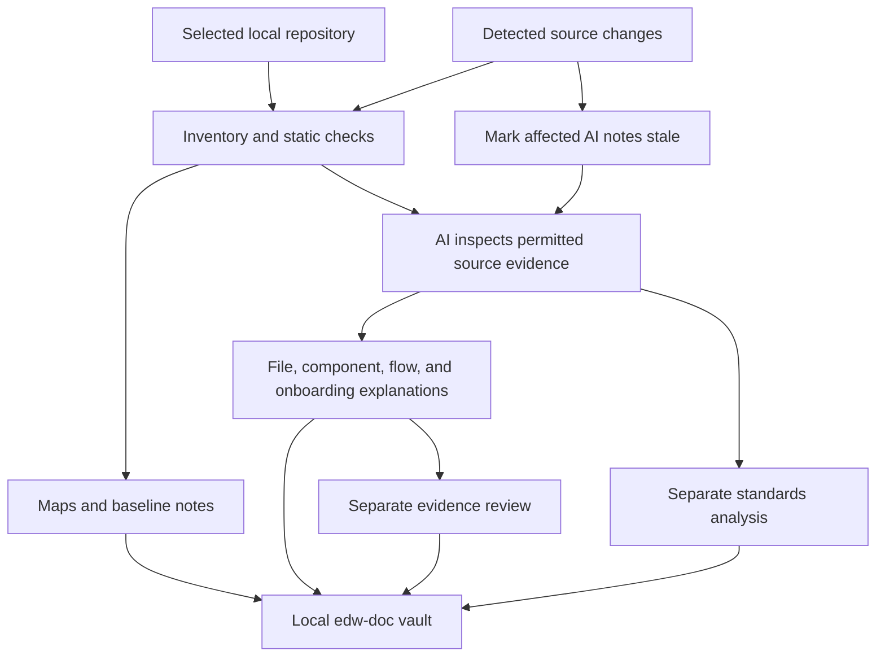

# EDW Doc: capabilities, scope, and preservation rules

EDW Doc helps engineers understand an unfamiliar repository. It creates a local knowledge folder named `edw-doc/`, with maps, linked file explanations, process walkthroughs, standards references, and onboarding guides. Since version 0.2.0, the plugin is named `edw-doc` and commands use `/edw-doc:*`; earlier releases used the name Doc Vault.

The goal is to make it easier to find how something works, what checks it performs, and where to investigate a problem. Explanations include source references, analysis dates, and visible gaps so readers can judge how much to rely on them.

## What it provides

| Capability | What an engineer receives |
|---|---|
| Repository discovery | An evidence-based description of the project's purpose, technologies, and component responsibilities. Different parts of one repository can use different analysis lenses. |
| Project and file maps | Navigation to supported source, configuration, test, pipeline, data-processing, and infrastructure files. Excluded and unsupported files remain visible in coverage reports. |
| Detailed explanations | Plain-language notes describing important contents, inputs, steps, decisions, outputs, checks, and failure paths. Tests are explained from their assertions and helpers, not just their names. |
| Process views | Numbered walkthroughs and diagrams when useful, with supporting source references and clear external or unknown boundaries. |
| Onboarding | A suggested reading order, project overview, entry points, representative workflows, configuration locations, and troubleshooting starting points. |
| Standards analysis | A separate specialist distinguishes declared requirements, observed conventions, and advisory guidance. File notes link to relevant standards; standards pages link back to assessed files. |
| Source-level findings | Evidence-backed observations about inconsistencies, possible redundancy, gaps, and improvement opportunities. Suggestions remain advisory. |
| Quality checks | Mechanical checks for references and evidence, plus a separate agent review of published claims. |
| Local maintenance | Change detection, refreshed maps, stale markers, and a queue of explanations requiring new AI analysis. |

Markdown and README files can provide evidence but do not receive duplicate file notes. Supported workbook inspection describes structure; it does not read every cell value, execute formulas or macros, or establish business rules by itself.

## How the work happens

1. **Optionally set up local integration.** Reuse the developer's existing instruction structure where possible and add the tool's own ignored files. Manual build and sync also work without this setup.
2. **Build the map.** Deterministic code inventories permitted files, records fingerprints, and creates navigation and baseline notes. This alone is not full AI analysis.
3. **Explain the project.** The active Claude Code session uses its configured model to inspect evidence and write draft explanations. Complex files receive more detail than simple files.
4. **Check the results.** Mechanical checks and a separate agent reviewer examine different aspects of quality. Standards assessments use their own specialist workflow.
5. **Keep it current.** Refresh static state after detected changes, then run AI synchronization to replace affected explanations with fresh analysis.

Ordinary wiki links connect related notes in Obsidian. Mermaid diagrams explain a process within a page; their edges do not themselves create Obsidian graph links. Dates and freshness state must be read together: an older explanation is not current merely because the file map was refreshed today.

## Local integration and preservation rules

The optional setup process adds owned instructions and configuration under `.claude/edw-doc/` for a fresh installation. Earlier owned `.claude/doc-vault/` installations are retained in place and can receive updated command instructions by repeating setup. It reuses a single supported, locally ignored Claude instruction entry point by adding a small marked reference. Existing tracked, unignored, AGENTS-only, or ambiguous instruction setups are preserved; an ignored rule adapter supplies the integration instead, unless an existing Claude import already supplies the reference. If no entry point is detected, setup can create a minimal ignored root `CLAUDE.md`. Setup reports instruction activation as unverified until checked in the actual host.

`AGENTS.md` is the standard plural filename. A custom `AGENT.md` is preserved without assuming the host automatically loads it. Setup does not create `CLAUDE.local.md` or change global instructions. See [installation](installation.md) for supported entry points and host requirements.

The preservation rules are:

1. **Reuse before creating.** Add only the missing tool-owned files and references. Preserve the developer's existing structure.
2. **No duplicate installation.** Repeated setup recognizes its files and marked references instead of adding another copy.
3. **Preserve user edits.** Ownership records and content fingerprints identify unchanged managed content. Updates or removal preserve edited or conflicting content and report what needs attention.
4. **Keep existing configuration.** Do not replace Claude settings, other rules, agents, or hooks. Hook logic ships with the plugin so local setup does not register duplicate hooks.
5. **Respect Git tracking.** Create a missing `.gitignore` or append the exact required ignore entries while preserving existing content. Never untrack files. Ignoring a file that Git already tracks does not make its changes private.
6. **Protect personal notes.** Keep personal additions in `edw-doc/annotations/`. Managed vault notes are checked before replacement; detected manual edits require resolution instead of silent overwriting.
7. **Remove only owned additions.** Uninstall removes unchanged integration files or marked blocks it owns. It preserves repository instructions, user changes, ignore entries, directories, and the generated knowledge vault. Automatic maintenance is disabled even when edited integration content remains.
8. **Keep permissions separate.** Setup has a small integration write allowance. Analysis agents retain their restricted documentation permissions; these instructions do not limit unrelated work by the developer's normal coding agent.

## Maintenance: what is automatic

For an existing vault with local maintenance enabled, plugin hooks reconcile static state at session start, when a new request arrives, after tool activity, and when the agent finishes. Plan-mode and subagent events skip writes; repeated tool events are throttled. This detects additions, modifications, deletions, and supported renames. It refreshes maps, marks affected explanations stale, and makes pending analysis visible to the active session.

Changes made by an editor, a pull, or a branch switch are discovered at a later reconciliation event. Hook processing is bounded; it does not run a permanent background AI worker. The finish hook can display one nonblocking synchronization reminder for a changed snapshot. It never forces a documentation run. AI explanation updates still require the active host workflow, such as `/edw-doc:sync`; a hook event does not guarantee that analysis is complete. When Claude Code is closed, these session hooks do not run; the next session can catch up. An optional separate static watcher also does not invoke a model.

Each developer keeps a local vault. Pulling or pushing source does not upload, download, or merge generated documentation. A reference outside the selected repository remains an external boundary; the tool does not crawl it automatically.

## Scope and permission boundary

| Operation | Allowed scope |
|---|---|
| Ordinary analysis | Read broker-approved repository content; write managed output inside the configured vault; create or append the exact vault and `.claude` ignore rules. |
| Explicit setup and uninstall | Manage only the owned local integration files, supported marked instruction references, installation records, and required ignore additions. Preserve conflicts and existing user content. |
| Source changes | No edits to application code, tests, pipeline definitions, data, or other project content as a result of findings. |
| Execution and external access | No execution of repository tests, builds, scripts, formulas, or macros; no deployment, cloud inspection, remote repository crawl, or automatic publication. |

Restricted broker operations enforce the plugin's ordinary file-access boundary. They do not sandbox unrelated agents, other plugins, or commands a user runs separately. Model processing follows the active host's provider and data policies; local vault storage does not mean the model runs locally. See [the permission boundary](security.md).

## How to interpret the results

- **Mapped** means a path was inventoried; it does not mean its behavior was fully analyzed.
- **Current** means the recorded evidence matches the checked source state; it is not proof of complete or correct reasoning.
- **Reviewed** means a separate agent checked a particular version of an explanation. It is not human approval.
- **Complies, diverges, or noncompliant** are qualified source assessments against specific rules. Only a declared applicable requirement can support a noncompliant result. Unknown, not assessed, and stale remain distinct outcomes.
- **A finding** is an observation or proposed improvement to investigate. It is not an executed test result, production diagnosis, audit opinion, or compliance certification.

The tool supports engineering judgment. It does not replace code review, runtime testing, operational monitoring, or formal approval. For further detail, read [architecture](architecture.md), [standards](standards.md), and [known limits](limitations.md).
