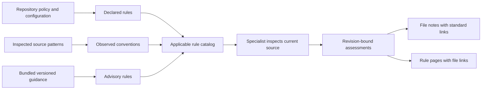

# Standards catalog and assessments

Run `/doc-vault:build` or `/doc-vault:sync` first, then `/doc-vault:standards`. The standards skill runs a separate specialist. It inspects the repository's languages, tests, CI/CD definitions, database work, and file/data transformations where those capabilities exist. It reads source and records evidence; it does not run linters, tests, database commands, or cloud operations.

## What appears in the vault

The broker creates a standards catalog and category navigation under `edw-doc/standards/`. Each rule describes its requirement, authority, scope, rationale, and inspection method. File notes contain a compact standards section with links to applicable rule pages. Rule pages link back to assessed files, so the reader can navigate in both directions. A coverage report exposes not-assessed, stale, and unknown work.

Initial build supplies bundled advisory rules and candidate applicability. It does not silently declare files compliant. The specialist uses current source evidence to register additional repository rules and assess relevant files. Unsupported, excluded, and reference-only files retain their coverage explanation rather than receiving invented assessments.

## Authority matters

| Authority | Meaning | Example |
|---|---|---|
| Declared | An explicit, cited repository requirement, configuration, schema, or contract | A checked-in configuration selects a rule for a defined source set. |
| Convention | A pattern observed in an identified sample, including exceptions | Several loaders use the same failure-reporting structure. |
| Advisory | Maintained guidance bundled with this plugin | A recommendation to inspect test assertions and their limits. |

Bundled references are offline material with provenance; they are not live web research during a run. A recommendation becomes a repository requirement only when inspected local evidence establishes adoption. The agent cannot create a new mandate merely to classify code as noncompliant.

## Reading results

| Result | Interpretation |
|---|---|
| Complies | Inspected evidence satisfies this specific rule within the recorded scope. |
| Diverges | Behavior differs from guidance or a convention; rationale explains the difference and uncertainty. |
| Noncompliant | A demonstrated violation of an applicable declared requirement. |
| Unknown | Available evidence cannot decide, including conflicting requirements or required runtime observations. |
| Not applicable | Inspected evidence shows the rule's condition does not apply to this file. |
| Not assessed | No completed assessment exists. This is coverage, not a favorable verdict. |
| Stale | The evidence or rule revision has changed; the prior result needs reassessment. |

These are source-level agent assessments, not a certification. A `complies` result does not mean every line is correct, a check was executed, or the whole repository meets a standard. Each assessment retains a reason, evidence, source hash, rule hash, and inspection time. Reviewer judgments remain separate from these assessments.

## Maintenance and review

After code, configuration, or standards change, run `/doc-vault:sync`, then `/doc-vault:standards` for affected scope. The runtime tracks stale records when their file, governing evidence, or rule changes. A plugin update may also change bundled guidance; installing it does not complete reassessment of every local vault.

Use `/doc-vault:review` to challenge important or disputed results in a separate context. Ask the reviewer to inspect scope, authority, original source, alternate paths, and legitimate exceptions. It records a qualified note review; it cannot silently replace the specialist's assessment. Preserve human context under `edw-doc/annotations/`.

## Extending rules safely

Add a maintained advisory rule to the plugin's bundled catalog when it is broadly useful and can be checked from available evidence. New repository-specific requirements can be registered by the specialist from current eligible sources. Describe a concrete condition and inspection method rather than "follow best practices." Keep technology/version limits and reference provenance visible, and add fictional regression examples for both a violation and a legitimate exception.

See the [tool contract](tool-contract.md), [analysis workflow](../workflows/standards.md), and [permission boundary](security.md) for the implementation contract.
